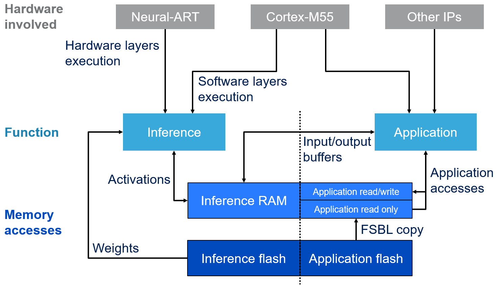
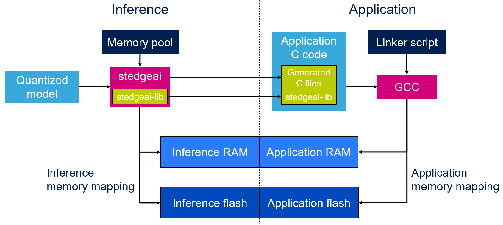

# Neural-ART: Description and Operation

The STM32N6 integrates a dedicated engine to accelerate convolutional neural network (CNN) inference, called Neural-ART.

## Memory Management

Neural-ART operates alongside the Cortex-M55 core and runs autonomously. A dedicated compiler, included with [STEdgeAI](https://www.st.com/en/development-tools/stedgeai-core.html), generates all the code and data required by Neural-ART. Two kinds of artifacts are produced:
- C sources and headers to include in the application project, enabling the CPU to interact with Neural-ART (start/stop inference, handle the calculation of unsupported layers, etc.).
- A standalone binary containing the model weights.

On typical GPU/CPU inference, memory for the model is often a single, large block. With Neural-ART, memory is explicitly divided into:
- Read-only data: model weights.
- Read/write buffers: intermediate results (layer inputs/outputs), known as activations.

These buffers have different access patterns and are placed in different regions: activations in RAM, weights typically in external flash.

Because the application and the inference engine run in parallel, they must not share the same memory areas. Memory—both RAM and flash—must be partitioned carefully.

Similar to how the C compiler uses a linker script, `stedgeai` uses a memory pool file (`.mpool`) to map activations and weights. The linker script and the memory pool must be coordinated to avoid overlap. This is a trade-off: allocating more RAM to activations leaves less RAM for the application.

Two main RAM types are available:
- NPURAM (AXISRAM3 to AXISRAM6): optimized for Neural-ART access.
- AXISRAM1 and AXISRAM2: general-purpose RAM.

This GettingStarted project provides example memory pools for both boards: [NUCLEO-N657X0-Q](../Model/my_mpools/stm32n6-app2_NUCLEO-N657X0-Q.mpool) and [STM32N6570-DK](../Model/my_mpools/stm32n6-app2_STM32N6570-DK.mpool).

The diagram below illustrates interactions among hardware blocks, the application, inference, and memory layout:

On the [ST Edge AI Developer Cloud](https://stedgeai-dc.st.com/home), a [custom Netron view](https://stedgeai-dc.st.com/assets/netron/index.html) visualizes memory usage across inference steps. Open `st_ai_output/<model_name>_c_info.json` in the web app to explore buffer sizes and lifetimes.

The boundary between the application and the inference engine is the model’s input and output buffers:
- Input: filled by the CPU or another IP (DCMIPP, DMA2D, etc.) before inference.
- Output: read by the CPU after inference to perform post-processing.

Input/output buffers may reside in application RAM or inference RAM, depending on needs. In this GettingStarted project, both are placed in inference RAM to reduce application-side memory by nesting them within the activation buffer area. The trade-off is that double buffering cannot be used, because the input buffer is not accessible while inference is running.

## Tool Interactions

Neural network inference still requires coordination between Neural-ART and the CPU—for example, to synchronize start/end of inference and to process layers not supported natively by Neural-ART. `stedgeai` generates `.c/.h` files to implement these interactions (shown in green in the diagram) and they must be included in your application project.

While Neural-ART supports most common layers, the application should also include `stedgeai-lib` so that the CPU can handle any unsupported layers. During compilation, `stedgeai` partitions execution between Neural-ART and CPU based on the model’s layers, enabling a seamless inference pipeline across IPs. The generated files are model-specific and should be updated each time you recompile a model. In contrast, `stedgeai-lib` is versioned: update it only when you upgrade `stedgeai`, and ensure the library version matches the compiler version used for your model.

Interactions between `stedgeai` and the C compiler:

For more information on ST Edge AI and Neural-ART, see the [online documentation](https://stedgeai-dc.st.com/assets/embedded-docs/index.html).
