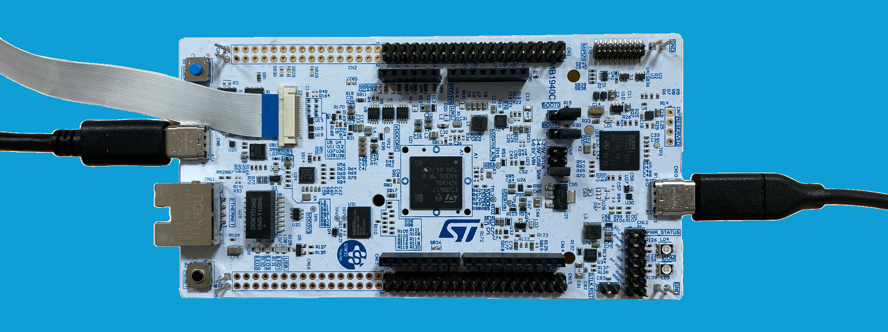
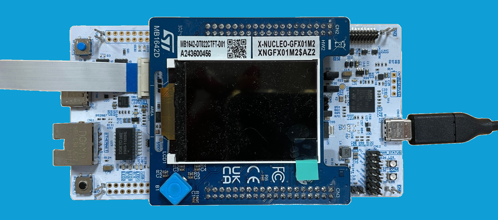
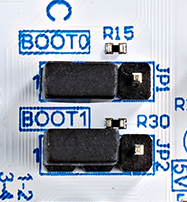
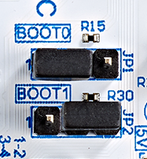

# __Object Detection Getting Started__

---

This project provides a real-time embedded environment for STM32N6 microcontroller to execute [STEdgeAI](https://www.st.com/en/development-tools/stedgeai-core.html) generated models, specifically targeting the object detection application. The code prioritizes clarity and understandability over performance, making it an ideal starting point for further development.


Detected classes and confidence level are displayed on the bounding boxes.

This is a standalone project that can be deployed directly to hardware. It is also integrated into the [ST ModelZoo repository](https://github.com/STMicroelectronics/stm32ai-modelzoo-services), and is required to deploy the object detection use case. The ModelZoo enables you to train, evaluate, and automatically deploy any supported model. If you wish to use this project as part of the ModelZoo, please refer to the [Quickstart using stm32ai-modelzoo-services](#quickstart-using-stm32ai-modelzoo-services) section for instructions.

This README provides an overview of the application. Additional documentation is available in the [Doc](./Doc/) folder.

---

## Table of Contents

- [Features Demonstrated](#features-demonstrated)
- [Hardware Support](#hardware-support)
- [Tools Version](#tools-version)
- [Boot Modes](#boot-modes)
- [Quickstart using stm32ai-modelzoo-services](#quickstart-using-stm32ai-modelzoo-services)
- [Quickstart using Prebuilt Binaries](#quickstart-using-prebuilt-binaries)
  - [Programming with STM32CubeProgrammer UI](#how-to-program-hex-files-using-stm32cubeprogrammer-ui)
  - [Programming STM32N6570-DK via Command Line](#how-to-program-hex-files-on-stm32n6570-dk-using-command-line)
  - [Programming NUCLEO-N657X0-Q via Command Line](#how-to-program-hex-files-on-nucleo-n657x0-q-using-command-line)
- [Quickstart using Source Code](#quickstart-using-source-code)
  - [Build and Run - Dev Mode](#application-build-and-run---dev-mode)
    - [STM32CubeIDE](#stm32cubeide)
    - [Makefile](#makefile)
  - [Build and Run - Boot from Flash](#application-build-and-run---boot-from-flash)
    - [Build the Application](#build-the-application)
      - [STM32CubeIDE](#stm32cubeide-1)
      - [Makefile](#makefile-1)
    - [Programming Firmware to External Flash](#program-the-firmware-in-the-external-flash)
- [How to update my project with a new version of ST Edge AI](#how-to-update-my-project-with-a-new-version-of-st-edge-ai)
- [Known Issues and Limitations](#known-issues-and-limitations)

**Documentation Folder:**

- [Application Overview](Doc/Application-Overview.md)
- [Boot Overview](Doc/Boot-Overview.md)
- [Camera Build Options](Doc/Build-Options.md#cameras-module)
- [Camera Orientation](Doc/Build-Options.md#camera-orientation)
- [Aspect Ratio Mode](Doc/Build-Options.md#aspect-ratio-mode)
- [Neural-ART: Description and Operation](Doc/Neural-ART-Description-and-Operation.md)
- [Deploying your Quantized Model](Doc/Deploy-your-Quantized-Model.md)
- [Programming Hex Files with STM32CubeProgrammer](Doc/Program-Hex-Files-STM32CubeProgrammer.md)

---

## Features Demonstrated

- Sequential application flow
- NPU-accelerated quantized AI model inference
- Dual DCMIPP pipelines
- DCMIPP cropping, decimation, and downscaling
- DCMIPP ISP usage
- LTDC dual-layer implementation
- Development mode
- Boot from external flash

---

## Hardware Support

Supported development platforms:

- [STM32N6570-DK](https://www.st.com/en/evaluation-tools/stm32n6570-dk.html) Discovery Board
  - Connect to the onboard ST-LINK debug adapter (CN6) using a __USB-C to USB-C cable__ for sufficient power.
  - OTP fuses are configured for xSPI IOs to achieve maximum speed (200MHz) on xSPI interfaces.
- [NUCLEO-N657X0-Q](https://www.st.com/en/evaluation-tools/nucleo-n657x0-q.html) Nucleo Board
  - Connect to the onboard ST-LINK debug adapter (CN9) using a __USB-C to USB-C cable__ for sufficient power.
  - OTP fuses are configured for xSPI IOs to achieve maximum speed (200MHz) on xSPI interfaces.


STM32N6570-DK board with MB1854B IMX335.

Supported camera modules:

- Provided IMX335 camera module
- [STEVAL-55G1MBI](https://www.st.com/en/evaluation-tools/steval-55g1mbi.html)
- [STEVAL-66GYMAI](https://www.st.com/en/evaluation-tools/steval-66gymai.html)
- [STEVAL-1943-MC1](https://www.st.com/en/evaluation-tools/steval-1943-mc1.html)

For the Nucleo board, one of the following displays is required:

- A USB host for data transmission via USB/UVC (using the USB OTG port CN8)


NUCLEO-N657X0-Q board with USB/UVC display.

- [X-NUCLEO-GFX01M2](https://www.st.com/en/evaluation-tools/x-nucleo-gfx01m2.html) SPI display


NUCLEO-N657X0-Q board with SPI display.

---

## Tools Version

- [STM32CubeIDE](https://www.st.com/content/st_com/en/products/development-tools/software-development-tools/stm32-software-development-tools/stm32-ides/stm32cubeide.html) (__v1.17.0__)
- [STM32CubeProgrammer](https://www.st.com/en/development-tools/stm32cubeprog.html) (__v2.18.0__)
- [STEdgeAI](https://www.st.com/en/development-tools/stedgeai-core.html) (__v3.0.0__)

---

## Boot Modes

The STM32N6 series does not have internal flash memory. To retain firmware after a reboot, program it into the external flash. Alternatively, you can load firmware directly into SRAM (development mode), but note that the program will be lost if the board is powered off in this mode.

Development Mode: used for loading firmware into RAM during a debug session or for programming firmware into external flash.

Boot from Flash: used to boot firmware from external flash.

|                  | STM32N6570-DK                                                                | NUCLEO-N657X0-Q                                                                  |
| -------------    | -------------                                                                |-----------------                                                                 |
| Boot from flash  |  |  |
| Development mode |        |        |

---

## Quickstart using stm32ai-modelzoo-services

This application is a C-based project required by the deployment service in the [ModelZoo](https://github.com/STMicroelectronics/stm32ai-modelzoo-services/tree/main). The ModelZoo enables you to train, evaluate, and automatically deploy any supported model.

To deploy your model using the ModelZoo, refer to the [Deployment README for STM32N6](https://github.com/STMicroelectronics/stm32ai-modelzoo-services/blob/main/object_detection/deployment/README_STM32N6.md) for detailed instructions on deploying to either the STM32N6570-DK or the NUCLEO-N657X0-Q.

__Note__: This C-based application is already included in the ModelZoo repository under [STM32N6 object detection application code folder](https://github.com/STMicroelectronics/stm32ai-modelzoo-services/tree/main/application_code/object_detection/STM32N6).

---

## Quickstart using Prebuilt Binaries

The prebuilt binaries are an assembly of several binaries:
  - FSBL (First Stage Boot Loader, loading the application from flash to RAM)
  - The application
  - The weights of the neural network model

### STM32N6570-DK

To program the board's external flash, follow these steps:

1. Set the board to [development mode](#boot-modes).
2. Program `Binary/STM32N6570-DK/STM32N6570-DK_GettingStarted_ObjectDetection.hex`.
3. Set the board to [boot from flash mode](#boot-modes).
4. Power cycle the board.
5. Place a person in front of the camera to detect them.

### NUCLEO-N657X0-Q USB/UVC

To program the board's external flash, follow these steps:

1. Set the board to [development mode](#boot-modes).
2. Program `Binary/NUCLEO-N657X0-Q/USB-UVC-Display/NUCLEO-N657X0-Q_GettingStarted_ObjectDetection-uvc.hex`.
3. Set the board to [boot from flash mode](#boot-modes).
4. Connect a USB cable to the USB OTG port (CN8), next to the RJ45 port. Connect the other end to a USB host (PC, USB hub, etc.) for data transmission via USB/UVC.
5. Power cycle the board.
6. Start the camera application on the host. On Windows, search for "camera" in the Start menu.
7. Place a person in front of the camera to detect them.

### NUCLEO-N657X0-Q SPI

To program the board's external flash, follow these steps:

1. Set the board to [development mode](#boot-modes).
2. Program `Binary/NUCLEO-N657X0-Q/SPI-Display/NUCLEO-N657X0-Q_GettingStarted_ObjectDetection-spi.hex`.
3. Set the board to [boot from flash mode](#boot-modes).
4. Power cycle the board.
5. Place a person in front of the camera to detect them.

---

### How to Program Hex Files Using STM32CubeProgrammer UI

See [How to program hex files STM32CubeProgrammer](Doc/Program-Hex-Files-STM32CubeProgrammer.md).

---

### How to Program Hex Files on STM32N6570-DK Using Command Line

Ensure the STM32CubeProgrammer `bin` folder is in your PATH.

```bash
export DKEL="<STM32CubeProgrammer_N6 Install Folder>/bin/ExternalLoader/MX66UW1G45G_STM32N6570-DK.stldr"

STM32_Programmer_CLI -c port=SWD mode=HOTPLUG -el $DKEL -hardRst -w Binary/STM32N6570-DK/STM32N6570-DK_GettingStarted_ObjectDetection.hex
```

---

### How to Program Hex Files on NUCLEO-N657X0-Q Using Command Line

Ensure the STM32CubeProgrammer `bin` folder is in your PATH.

```bash
export NUEL="<STM32CubeProgrammer_N6 Install Folder>/bin/ExternalLoader/MX25UM51245G_STM32N6570-NUCLEO.stldr"

# USB/UVC
STM32_Programmer_CLI -c port=SWD mode=HOTPLUG -el $NUEL -hardRst -w Binary/NUCLEO-N657X0-Q/USB-UVC-Display/NUCLEO-N657X0-Q_GettingStarted_ObjectDetection-uvc.hex

# SPI
STM32_Programmer_CLI -c port=SWD mode=HOTPLUG -el $NUEL -hardRst -w Binary/NUCLEO-N657X0-Q/SPI-Display/NUCLEO-N657X0-Q_GettingStarted_ObjectDetection-spi.hex
```

---

## Quickstart using Source Code

Before building and running the application, you must program `Model/<board_name>/network_data.hex` (model weights and biases). This only needs to be done once unless you change the AI model. See [Quickstart using prebuilt binaries](#quickstart-using-prebuilt-binaries) for details.

For more information about boot modes, see [Boot Overview](Doc/Boot-Overview.md).

__Note__: To select the NUCLEO-N657X0-Q display interface, use the appropriate build configuration in CubeIDE, or specify `SCR_LIB_SCREEN_ITF=UVCL` or `SCR_LIB_SCREEN_ITF=SPI` as a Makefile option (default is UVCL).

---

### Application Build and Run - Dev Mode

Set your board to [development mode](#boot-modes).

#### STM32CubeIDE

Double-click `Application/<board_name>/STM32CubeIDE/.project` to open the project in STM32CubeIDE. Build and run the project.

#### Makefile

Navigate to `Application/<board_name>/` and run the following commands (ensure required tools are in your PATH):

1. Build the project:
    ```bash
    make -j8
    ```
2. Start a GDB server connected to the STM32 target:
    ```bash
    ST-LINK_gdbserver -p 61234 -l 1 -d -s -cp <path-to-stm32cubeprogramer-bin-dir> -m 1 -g
    ```
3. In a separate terminal, launch a GDB session to load the firmware:
    ```bash
    $ arm-none-eabi-gdb build/Application/<board_name>/Project.elf
    (gdb) target remote :61234
    (gdb) monitor reset
    (gdb) load
    (gdb) continue
    ```

---

### Application Build and Run - Boot from Flash

Set your board to [development mode](#boot-modes).

#### Build the Application

##### STM32CubeIDE

Double-click `Application/<board_name>/STM32CubeIDE/.project` to open the project in STM32CubeIDE. Build and run the project.

##### Makefile

Ensure all required tools are in your PATH, then build the project:

```bash
make -j8
```

#### Program the Firmware in the External Flash

After building the application, you must sign the binary file:

```bash
STM32_SigningTool_CLI -bin build/Application/<board_name>/Project.bin -nk -t ssbl -hv 2.3 -o build/Application/<board_name>/Project_sign.bin
```

Program the signed binary at address `0x70100000`, as well as the FSBL and network parameters.

On STM32N6570-DK:

```bash
export DKEL="<STM32CubeProgrammer_N6 Install Folder>/bin/ExternalLoader/MX66UW1G45G_STM32N6570-DK.stldr"

# First Stage Boot Loader
STM32_Programmer_CLI -c port=SWD mode=HOTPLUG -el $DKEL -hardRst -w FSBL/ai_fsbl.hex

# Adjust build path as needed
STM32_Programmer_CLI -c port=SWD mode=HOTPLUG -el $DKEL -hardRst -w build/Application/STM32N6570-DK/Project_sign.bin 0x70100000

# Network parameters
STM32_Programmer_CLI -c port=SWD mode=HOTPLUG -el $DKEL -hardRst -w Model/STM32N6570-DK/network_data.hex
```

On NUCLEO-N657X0-Q:

```bash
export NUEL="<STM32CubeProgrammer_N6 Install Folder>/bin/ExternalLoader/MX25UM51245G_STM32N6570-NUCLEO.stldr"

# First Stage Boot Loader
STM32_Programmer_CLI -c port=SWD mode=HOTPLUG -el $NUEL -hardRst -w FSBL/ai_fsbl.hex

# Adjust build path as needed
STM32_Programmer_CLI -c port=SWD mode=HOTPLUG -el $NUEL -hardRst -w build/Application/NUCLEO-N657X0-Q/Project_sign.bin 0x70100000

# Network parameters
STM32_Programmer_CLI -c port=SWD mode=HOTPLUG -el $NUEL -hardRst -w Model/NUCLEO-N657X0-Q/network_data.hex
```

__Note__: Only the application binary needs to be programmed if `fsbl` and `network_data.hex` have already been programmed.

Set your board to [boot from flash](#boot-modes) mode and power cycle to boot from external flash.

---

## How to update my project with a new version of ST Edge AI

The neural network model files (`network.c/h`, `stai_network.c/h`, etc.) included in this project were generated using [STEdgeAI](https://www.st.com/en/development-tools/stedgeai-core.html) version 3.0.0.

Using a different version of STEdgeAI to generate these model files may result in the following compile-time error:  
`Possible mismatch in ll_aton library used`.

If you encounter this error, please follow the STEdgeAI instructions on [How to update my project with a new version of ST Edge AI Core](https://stedgeai-dc.st.com/assets/embedded-docs/stneuralart_faqs_update_version.html) to update your project.

---

## Known Issues and Limitations

- Only RGB888 format for neural network input has been tested.
- Only UINT8 format for neural network input is supported.
